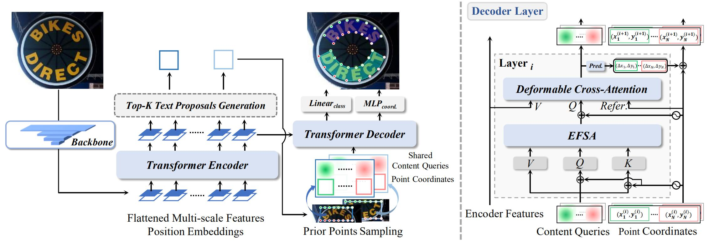

<h1 align="center"> DPText-DETR: Towards Better Scene Text Detection with Dynamic Points in Transformer </h1> 

<p align="center">
<a href="https://arxiv.org/pdf/2207.04491v2.pdf">"></a>
<a href="https://paperswithcode.com/sota/scene-text-detection-on-total-text?p=dptext-detr-towards-better-scene-text"></a>
<a href="https://paperswithcode.com/sota/scene-text-detection-on-scut-ctw1500?p=dptext-detr-towards-better-scene-text"></a>
</p>

<p align="center">
  <a href="#Introduction">Introduction</a> |
  <a href="#Updates">Updates</a> |
  <a href="#Main Results">Main Results</a> |
  <a href="#Usage">Usage</a> |
  <a href="#Citation">Citation</a> |
  <a href="#Acknowledgment">Acknowledgement</a>
</p >
This is the official repo for the paper "DPText-DETR: Towards Better Scene Text Detection with Dynamic Points in Transformer", which is accepted to AAAI 2023.

## Introduction



**Abstract.** Recently, Transformer-based methods, which predict polygon points or Bezier curve control points for localizing texts, are popular in scene text detection. However, these methods built upon detection transformer framework might achieve sub-optimal training efficiency and performance due to coarse positional query modeling. In addition, the point label form exploited in previous works implies the reading order of humans, which impedes the detection robustness from our observation. To address these challenges, this paper proposes a concise Dynamic Point Text DEtection TRansformer network, termed DPText-DETR. In detail, DPText-DETR directly leverages explicit point coordinates to generate position queries and dynamically updates them in a progressive way. Moreover, to improve the spatial inductive bias of non-local self-attention in Transformer, we present an Enhanced Factorized Self-Attention module which provides point queries within each instance with circular shape guidance. Furthermore, we design a simple yet effective positional label form to tackle the side effect of the previous form. To further evaluate the impact of different label forms on the detection robustness in real-world scenario, we establish an Inverse-Text test set containing 500 manually labeled images. Extensive experiments prove the high training efficiency, robustness, and state-of-the-art performance of our method on popular benchmarks.

## Updates
`[Mar.07, 2023]` The code and models of our latest work DeepSolo (CVPR 2023, [Code](https://github.com/ViTAE-Transformer/DeepSolo)) are released. :fire::fire:

`[Nov.29, 2022]` The code and models are released. The Arxiv version paper is updated.

`[Jul.12, 2022]` Inverse-Text is available.

`[Jul.10, 2022]`The paper is submitted to ArXiv. Inverse-Text test set will be available very soon. Work in progress.

## Main Results

|Benchmark|Backbone|Precision|Recall|F-measure|Pre-trained Model|Fine-tuned Model|
|:------:|:------:|:------:|:------:|:------:|:------:|:------:|
|Total-Text|Res50|91.8|86.4|89.0|[OneDrive](https://1drv.ms/u/s!AimBgYV7JjTlgccGbLGc9wYB-CGfpg?e=kpyje7)/[Baidu](https://pan.baidu.com/s/1MatDxMtAc2HhI56otNQ3pA)(osxo)|[OneDrive](https://1drv.ms/u/s!AimBgYV7JjTlgccKyruwWCE09pdxnA?e=sMx7fq)/[Baidu](https://pan.baidu.com/s/1Vs69ZGp9HeJzGqptupx3uw)(p268)|
|CTW1500|Res50|91.7|86.2|88.8|*The same as above* ↑|[OneDrive](https://1drv.ms/u/s!AimBgYV7JjTlgccJzxovPI8jwlbDzg?e=IUAYHv)/[Baidu](https://pan.baidu.com/s/1a5eUHOwK1udHSD3ZP21TdA)(disp)|
|ICDAR19 ArT|Res50|83.0|73.7|78.1|[OneDrive](https://1drv.ms/u/s!AimBgYV7JjTlgccH_WYEdZc5oXPCTw?e=ZluxqK)/[Baidu](https://pan.baidu.com/s/1GAWyJIL-d3MEW0hWKYfArA)(7sfe)|[OneDrive](https://1drv.ms/u/s!AimBgYV7JjTlgccIHXZbf1NmAVtczg?e=1wuJzE)/[Baidu](https://pan.baidu.com/s/1MNngf_vJlSsqgbHKf6K-bA)(z8if)|

## Usage

It's recommended to configure the environment using Anaconda. Python 3.8 + PyTorch 1.9.1 (or 1.9.0) + CUDA 11.1 + Detectron2 (v0.6) are suggested.

- ### Installation
```
conda create -n DPText-DETR python=3.8 -y
conda activate DPText-DETR
pip install torch==1.9.1+cu111 torchvision==0.10.1+cu111 -f https://download.pytorch.org/whl/torch_stable.html
pip install opencv-python scipy timm shapely albumentations Polygon3
python -m pip install detectron2 -f https://dl.fbaipublicfiles.com/detectron2/wheels/cu111/torch1.9/index.html
pip install setuptools==59.5.0
git clone https://github.com/ymy-k/DPText-DETR.git
cd DPText-DETR
python setup.py build develop
```

- ### Data Preparation

>**SynthText-150K & MLT & LSVT (images):**  [Source](https://github.com/aim-uofa/AdelaiDet/tree/master/datasets) 
>
>**Total-Text (including rotated images)**: [OneDrive](https://1drv.ms/u/s!AimBgYV7JjTlgccOW1TUlgm64M0yRA?e=jwY6b1)
>
>**CTW1500 (including rotated images)**: [OneDrive](https://1drv.ms/u/s!AimBgYV7JjTlgccPGEv4DkiUl23MEg?e=44CtL6)
>
>**ICDAR19 ArT (including rotated images)**: [BaiduNetdisk](https://pan.baidu.com/s/1zHW921lucH5mGC3nJLTSSg)(peeb)
>
>**Inverse-Text (images):** [OneDrive](https://1drv.ms/u/s!AimBgYV7JjTlgccVhlbD4I3z5QfmsQ?e=myu7Ue) | [BaiduNetdisk](https://pan.baidu.com/s/1A0JaNameuM0GZxch8wdm6g)(6a2n). *Note that some "test_poly.json" files are only used to read images.* **Inverse-Text is for research purpose only**. More details of Inverse-Text can be referred to the paper.

>**Json files:** [OneDrive](https://1drv.ms/u/s!AimBgYV7JjTlgccNWKEMwwbJO4TYQw?e=ridXPV) | [BaiduNetdisk](https://pan.baidu.com/s/1bDE1z6c7z6wCTY5W-jJ3Qw)(44yt)

>**The ground-truths and lexicons** can be downloaded here: [OneDrive](https://1drv.ms/u/s!AimBgYV7JjTlgccL51PYHmj1gZk-cA?e=m9rUpT) | [BaiduNetdisk](https://pan.baidu.com/s/1RCsic0Hrt0EQg8ryqVM3ag)(raln). *The ground-truths are processed into the form used in [AdelaiDet](https://github.com/aim-uofa/AdelaiDet).*

Organize them as follows:
```
|- datasets
   |- syntext1
   |  |- train_images
   |  └─ train_poly_pos.json  # "pos" denotes the positional label form
   |- syntext2
   |  |- train_images
   |  └─ train_poly_pos.json
   |- mlt
   |  |- train_images
   |  └─ train_poly_pos.json
   |- totaltext
   |  |- test_images_rotate
   |  |- train_images_rotate
   |  |- test_poly.json
   |  |- test_poly_rotate.json
   |  |─ train_poly_ori.json
   |  |─ train_poly_pos.json
   |  |─ train_poly_rotate_ori.json
   |  └─ train_poly_rotate_pos.json
   |- ctw1500
   |  |- test_images
   |  |- train_images_rotate
   |  |- test_poly.json
   |  └─ train_poly_rotate_pos.json
   |- lsvt
   |  |- train_images
   |  └─ train_poly_pos.json
   |- art
   |  |- test_images
   |  |- train_images_rotate
   |  |- test_poly.json
   |  |─ train_poly_pos.json
   |  └─ train_poly_rotate_pos.json
   |- inversetext
   |  |- test_images
   |  └─ test_poly.json
   |- evaluation
   |  |- lexicons
   |  |- gt_totaltext.zip
   |  |- gt_ctw1500.zip
   |  |- gt_inversetext.zip
   |  └─ gt_totaltext_rotate.zip
```

The generation of positional label form is provided in `process_positional_label.py`

- ### Training

**1. Pre-train:**
To pre-train the model for Total-Text and CTW1500, the config file should be `configs/DPText_DETR/Pretrain/R_50_poly.yaml`. For ICDAR19 ArT, please use `configs/DPText_DETR/Pretrain_ArT/R_50_poly.yaml`. Please adjust the GPU number according to your situation.

```
python tools/train_net.py --config-file ${CONFIG_FILE} --num-gpus 4
```

**2. Fine-tune:**
With the pre-trained model, use the following command to fine-tune it on the target benchmark. The pre-trained models are also provided.  For example:

```
python tools/train_net.py --config-file configs/DPText_DETR/TotalText/R_50_poly.yaml --num-gpus 4
```

- ### Evaluation
```
python tools/train_net.py --config-file ${CONFIG_FILE} --eval-only MODEL.WEIGHTS ${MODEL_PATH}
```
For ICDAR19 ArT, a file named `art_submit.json` will be saved in `output/r_50_poly/art/finetune/inference/`. The json file can be directly submitted to [the official website](https://rrc.cvc.uab.es/?ch=14) for evaluation.

- ### Inference & Visualization
```
python demo/demo.py --config-file ${CONFIG_FILE} --input ${IMAGES_FOLDER_OR_ONE_IMAGE_PATH} --output ${OUTPUT_PATH} --opts MODEL.WEIGHTS <MODEL_PATH>
```

## Citation

If you find DPText-DETR useful in your research, please consider citing:
```bibtex
@inproceedings{ye2022dptext,
  title={DPText-DETR: Towards Better Scene Text Detection with Dynamic Points in Transformer},
  author={Ye, Maoyuan and Zhang, Jing and Zhao, Shanshan and Liu, Juhua and Du, Bo and Tao, Dacheng},
  booktitle={Proceedings of the AAAI Conference on Artificial Intelligence},
  volume={37},
  number={3},
  pages={3241--3249},
  year={2023}
}
```

## Acknowledgement

DPText-DETR is inspired a lot by [Deformable DETR](https://github.com/fundamentalvision/Deformable-DETR), [DAB-DETR](https://github.com/IDEA-opensource/DAB-DETR), and [TESTR](https://github.com/mlpc-ucsd/TESTR). Thanks for their great works!