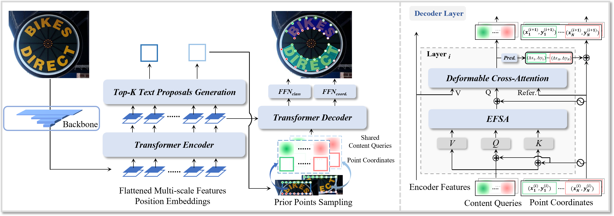

<h1 align="center"> DPText-DETR: Towards Better Scene Text Detection with Dynamic Points in Transformer </h1> 

<!--

<a href="https://arxiv.org">"></a>

-->

  <a href="#Updates">Updates</a> |
  <a href="#Introduction">Introduction</a> |
  <a href="#Main Results">Main Results</a> |
  <a href="#Inverse-Text">Inverse-Text</a> |
  <a href="#Citation">Citation</a> |
  <a href="#Acknowledgment">Acknowledgment</a>

*This is the official repo for the paper "DPText-DETR: Towards Better Scene Text Detection with Dynamic Points in Transformer".*

***

## Updates
>***[10/7/2022]*** The paper is submitted to ArXiv. Inverse-Text test set will be available very soon. Work in progress.

## Introduction

**Abstract.** Recently, Transformer-based methods, which predict polygon points or Bezier curve control points to localize texts, are quite popular in scene text detection. However, the used point label form implies the reading order of humans, which affects the robustness of Transformer model. As for the model architecture, the formulation of queries used in decoder has not been fully explored by previous methods. In this paper, we propose a concise dynamic point scene text detection Transformer network termed DPText-DETR, which directly uses point coordinates as queries and dynamically updates them between decoder layers. We point out a simple yet effective positional point label form to tackle the side effect of the original one. Moreover, an Enhanced Factorized Self-Attention module is designed to explicitly model the circular shape of polygon point sequences beyond non-local attention. Extensive experiments prove the training efficiency, robustness, and state-of-the-art performance on various arbitrary shape scene text benchmarks. Beyond detector, we observe that existing end-to-end spotters struggle to recognize inverse-like texts. To evaluate their performance objectively and facilitate future research, we propose an Inverse-Text test set containing 500 manually labeled images.

## Main Results

|Benchmark|Backbone|Precision|Recall|F-measure|Pre-trained Model|Finetuned Model|
|:------:|:------:|:------:|:------:|:------:|:------:|:------:|
|Total-Text|Res50|91.8|86.4|89.0|-|-|
|CTW1500|Res50|91.7|86.2|88.8|-|-|
|ICDAR19 ArT|Res50|83.0|73.7|78.1|-|-|

Some detection results:

## Inverse-Text

Inverse-Text is a test set with 500 images. About 40% text instances are inverse-like, and some of them are mirrored due to photographing. The background mainly includes outdoor scenes and some commodity packagings. Word-level polygon annotations are provided. Non-latin texts are annotated as "don't care". Inverse-Text is for research purpose only. Hope Inverse-Text is useful to your research. Looking forward to your suggestions. Some samples are shown as following.

**Inverse-Text testing images** can be downloaded here: [OneDrive]() | [百度网盘]() (password:). *Note that "test_poly.json" is only used to read images.*

**The ground-truths and lexicons** can be downloaded here: [OneDrive]() | [百度网盘]() (password:). *Note that the ground-truths are processed into the form used in AdelaiDet.*

<!--
## Citation

## Acknowledgement

This work is inspired a lot by [Deformable DETR](https://github.com/fundamentalvision/Deformable-DETR), [DAB-DETR](https://github.com/IDEA-opensource/DAB-DETR), and [TESTR](https://github.com/mlpc-ucsd/TESTR). The code is based on [AdelaiDet](https://github.com/aim-uofa/AdelaiDet) and TESTR. Thanks for their great works!
-->
